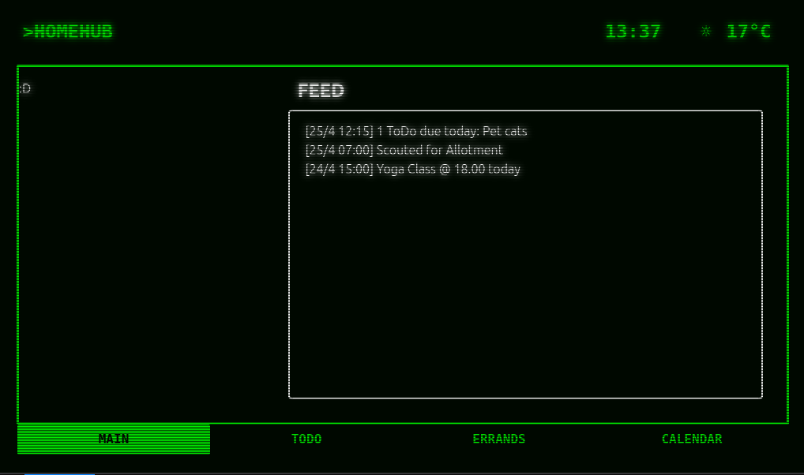
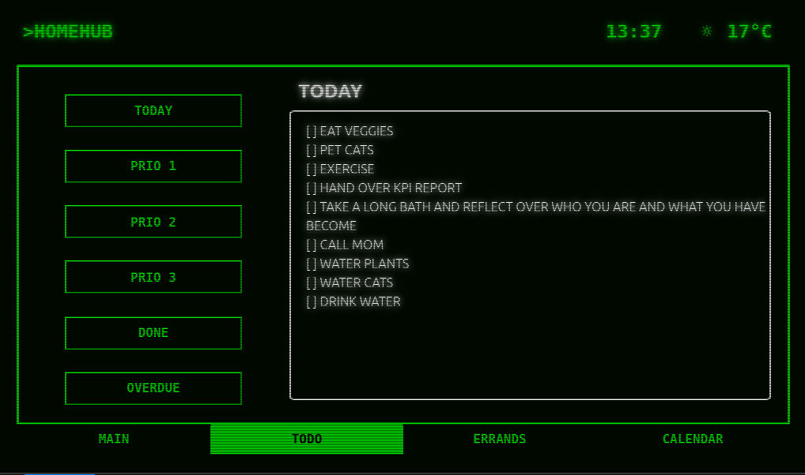

# homehub

Homehub is a software and hardware solution to allow quick access to what's up: todo's, calendar and scouting errands, which let's you search chosen websites for a given string at a set interval. Homehub runs on a Raspberry Pi 3 with an old harvested laptop screen and has a UI inspired by the Pip-Boy from the Fallout Games.

## Main view

## Todo view
